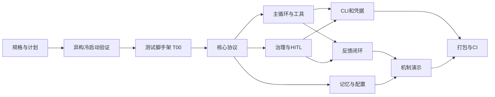

# Sentinel Coding Harness 实现计划

**状态说明：** 本计划在实现前完成。任务完成后必须在对应条目追加真实 commit hash、PR 链接、测试命令和实际子 agent；不得预填或伪造。

## 0. 依赖、分支和并行规则

- 初始文档在 `main` 建立真实基线；实现阶段每个功能组使用独立 worktree 和 feature branch。
- 每个 task 使用新鲜 subagent；同一 task 内遵循红测试 commit → 最小绿实现 commit → 必要重构 commit。
- feature 完成后先做 spec 合规审查、再做代码质量审查。发现 Critical issue 必须修复后才能合入。
- `PLAN.md` 的完成记录另起文档 commit，引用上一实现 commit 的真实 hash。
- 禁止并行修改共享的 action schema、package 配置、会话存储接口；并行分支通过 rebase 后合入。

## 1. 预实现与冷启动验证

### P01 — 初始化安全仓库基线

- **目标：** 建立 Git、忽略规则、SPEC、PLAN、过程/agent 日志；不写实现代码。
- **文件：** `.gitignore`、`SPEC.md`、`PLAN.md`、`SPEC_PROCESS.md`、`AGENT_LOG.md`。
- **预期：** 忽略密钥和运行数据；文档完整覆盖课程要求。
- **验证：** `git status --ignored`；`rg -n 'sk-' . --glob '!*.md'` 无命中。
- **依赖：** 无。

### P02 — 异构 agent 冷启动

- **目标：** 用 Cursor Agent（与 Codex 不同），新会话且只给 `SPEC.md`+`PLAN.md`，要求实现 `T01`。
- **文件：** `SPEC_PROCESS.md`、`AGENT_LOG.md`、冷启动输出的非敏感摘要。
- **预期：** 收集其暂停问题、误读和生成物；依据真实反馈修改 SPEC/PLAN。
- **实际初次结果：** Cursor 正确发现 P03 依赖未完成、测试脚手架被错误排在 T16、action/config/session 契约不完整，并在其独立目录的 `npm install` 遇到 `UNABLE_TO_GET_ISSUER_CERT_LOCALLY` 后停止；没有写入本仓库。
- **验证：** 保存提示词、会话隔离证据、问题清单和修订前后关键 diff。首次 Cursor 暂停及其问题清单是 P02 的正式证据；P03 后的 Cursor 重试是可选加分复测，不作为开始本仓库 T00 的前置条件，除非获得可验证的完整转录。
- **依赖：** P01；必须在任何生产实现代码之前完成。

### P03 — 冷启动反馈修订与确认

- **目标：** 修复冷启动暴露的歧义，记录“采纳/拒绝”的人类决定。
- **文件：** `SPEC.md`、`PLAN.md`、`SPEC_PROCESS.md`。
- **预期：** 明确 action envelope、风险默认值、失败停止条件和跨平台界限。
- **验证：** 自检无 `TODO/TBD`、无相互冲突规则；用户确认文档后进入实现。
- **依赖：** P02。

## 2. 阶段一：核心协议、循环与工具

Worktree：`feature/core-protocol`。P03 后执行，可由 2 个子 agent 顺序完成。

### T00 — 建立 TypeScript 测试脚手架（约 3–5 分钟）

- **目标：** 在任何 Harness 代码前建立可运行的 Node/TypeScript/Vitest 基线；此 task 只定义构建与测试入口，不实现 agent 机制。
- **文件：** `package.json`、`package-lock.json`、`tsconfig.json`、`vitest.config.ts`、`src/index.ts`、`tests/smoke.test.ts`。
- **红测：** 缺少 test/typecheck script 时 `npm test` 或 `npm run typecheck` 必须失败；加入 smoke test 后先观察测试框架可发现失败断言。
- **绿实现：** 固定 Node 20+、`vitest run`、`tsc --noEmit` 和最小 smoke test；不引入真实 LLM 或凭据。
- **验证：** `npm ci`、`npm test -- tests/smoke.test.ts`、`npm run typecheck`。若 registry 证书失败，只允许诊断代理/CA 并配置可信 CA；禁止 `strict-ssl=false`、跳过 TLS 或改用不可信 registry。
- **依赖：** P03。
- **实际完成：** 红提交 `72d82bb` 让 Vitest 实际报告预期失败断言；绿提交 `04d5914` 加入锁文件和最小入口后通过。经临时、受信 CA 环境变量完成 `npm ci`，随后定向 smoke 与 `npm run typecheck` 均退出 0；未把 CA、代理或 TLS 配置写入仓库。

### T01 — 定义 action/config/会话 schema（约 3–5 分钟）

- **目标：** 建立 Zod action envelope、语义验证器、配置默认值和核心类型。
- **文件：** `src/domain/actions.ts`、`src/domain/config.ts`、`src/domain/session.ts`、`tests/domain/actions.test.ts`。
- **红测：** 无效 enum、缺字段、unused 字段未省略/为 null、`write_file` 无 path、`run_command` 有 shell 控制字符均失败；空 `write_file.content` 与空 `run_command.args` 按 SPEC 被正确区分。
- **绿实现：** schema 将有效 envelope 转为 discriminated `Action`；冻结配置默认值。
- **验证：** `npm test -- tests/domain/actions.test.ts`，`npm run typecheck`。
- **依赖：** P03、T00。
- **实际完成：** 初始红/绿为 `b04062a` / `4b9537a`；Sol 审查发现 session 状态关联缺口后，补充红/绿为 `d889477` / `ca0a8f4`。最终 31 个定向契约测试和 32 个全量测试通过，typecheck 通过；不含真实 provider、凭据、循环或工具执行器。

### T02 — 抽象 LLM 与脚本化 mock（约 3–5 分钟）

- **目标：** 建立不依赖 provider 的 `LLMClient` 和可断言上下文的 `ScriptedMockLLM`。
- **文件：** `src/llm/client.ts`、`src/llm/scripted-mock.ts`、`tests/llm/scripted-mock.test.ts`。
- **红测：** mock 消费动作序列、记录输入上下文、序列耗尽时失败。
- **绿实现：** 只暴露 `decide(context)`；不包含 agent loop。
- **验证：** `npm test -- scripted-mock`。
- **依赖：** T01。
- **实际完成：** 红/绿为 `e6a8a80` / `997e75e`，并以合并提交 `74b6df6` 纳入核心分支。4 个定向、36 个全量测试和 typecheck 通过；mock 只消费预设响应并深拷贝记录 context，不含 provider、凭据或工具执行能力。

### T03 — 会话状态机与主循环骨架（约 4–5 分钟）

- **目标：** 实现 context 组装、step 计数、终态和错误状态；暂以 fake dispatcher 返回结果。
- **文件：** `src/core/agent-loop.ts`、`src/core/session-store.ts`、`tests/core/agent-loop.test.ts`。
- **红测：** mock 返回 `finish` 进入 completed；超过 maxSteps 进入 stopped；无效 action 安全失败。
- **绿实现：** 明确状态转移，状态持久化可注入。
- **验证：** `npm test -- agent-loop`。
- **依赖：** T01、T02。
- **实际完成：** 红/绿为 `3788a2b` / `68eff8c`，以 `73cb2a4` 合入。7 个定向、43 个全量测试和 typecheck 通过；只接入 fake dispatcher。Sol 明确记录 Guardrail、HITL、预算、重复动作与 provider timeout/retry 由后续任务负责，不能把本 task 当作完整生产主循环。

### T04 — 工作区文件工具与真实路径围栏（约 4–5 分钟）

- **目标：** 受控实现 list/read/write，拒绝越界和符号链接逃逸。
- **文件：** `src/tools/files.ts`、`src/security/workspace-fence.ts`、`tests/tools/files.test.ts`、`tests/security/workspace-fence.test.ts`。
- **红测：** `../`、绝对路径、指向工作区外的 symlink、二进制/过大文件均不可读写。
- **绿实现：** canonical path 检查、大小限制、结构化错误。
- **验证：** `npm test -- workspace-fence files`。
- **依赖：** T01。

### T05 — 参数化命令与测试工具（约 4–5 分钟）

- **目标：** 使用 `spawn(command,args)` 而非 shell；实现 timeout、输出截断和受控测试命令。
- **文件：** `src/tools/commands.ts`、`src/tools/tests.ts`、`tests/tools/commands.test.ts`。
- **红测：** 带 shell metacharacter 的命令、超时、过长输出和非零退出码被结构化处理。
- **绿实现：** allowlist hook、timeout、4 KiB 截断。
- **验证：** `npm test -- commands`。
- **依赖：** T01、T04。

## 3. 阶段二：治理、反馈、记忆与配置

Worktree：`feature/governance-feedback`（T06–T09）与 `feature/memory-config`（T10–T11）；T08 与 T10 可并行。

### T06 — 确定性策略引擎（约 4–5 分钟）

- **目标：** 为每个 action 返回 allow/approval/deny、规则 ID 和风险等级。
- **文件：** `src/security/policy.ts`、`src/security/rules.ts`、`tests/security/policy.test.ts`。
- **红测：** `rm -rf`、`git push`、`sudo`、工作区外、CI 改动均 deny/approval；读取和 `npm test` allow。
- **绿实现：** 配置优先级与默认保守规则。
- **验证：** `npm test -- policy`。
- **依赖：** T01、T04、T05。

### T07 — HITL 审批与恢复状态机（约 4–5 分钟）

- **目标：** 持久化 pending action，以 action hash 绑定批准，恢复前重新检查。
- **文件：** `src/security/approval.ts`、`src/core/session-store.ts`、`tests/security/approval.test.ts`。
- **红测：** 未批准不执行、错误 hash/过期批准不执行、一次批准不可重放、拒绝进入终态。
- **绿实现：** 原子状态写入与单向转换。
- **验证：** `npm test -- approval`。
- **依赖：** T03、T06。

### T08 — 审计日志与敏感信息脱敏（约 3–5 分钟）

- **目标：** 记录每次策略/工具/状态事件而不泄露 Key 或完整长内容。
- **文件：** `src/observability/audit.ts`、`src/observability/redact.ts`、`tests/observability/redact.test.ts`。
- **红测：** 伪 Key、Authorization、长文件内容在日志中不可见或被截断。
- **绿实现：** JSONL append 和统一 redactor。
- **验证：** `npm test -- redact audit`。
- **依赖：** T03。

### T09 — 反馈归类与回灌（约 4–5 分钟）

- **目标：** 将测试/命令结果归类，进入下一轮 `AgentContext.feedback`。
- **文件：** `src/feedback/summarizer.ts`、`src/feedback/verifier.ts`、`tests/feedback/summarizer.test.ts`、`tests/core/feedback-loop.test.ts`。
- **红测：** assertion/type/timeout 分类；第一次失败后 mock LLM 看见摘要并输出不同 action。
- **绿实现：** 截断、重复 action 检测、最多一次修复请求。
- **验证：** `npm test -- feedback-loop`。
- **依赖：** T03、T05、T06。

### T10 — 记忆存储与检索（约 3–5 分钟）

- **目标：** JSONL note 存储、关键词排序、去重和上下文上限。
- **文件：** `src/memory/store.ts`、`src/memory/retriever.ts`、`tests/memory/retriever.test.ts`。
- **红测：** 更相关且更新的 note 优先；重复/超长 note 拒绝；最多返回 5 条。
- **绿实现：** 确定性排序与截断。
- **验证：** `npm test -- memory`。
- **依赖：** T01。
- **实际完成：** 红/绿为 `f2e6227` / `d1b2d46`，以 `c8eb967` 合入。6 个定向、38 个全量测试与 typecheck 通过；JSONL 坏行会显式报错，检索按关键词重叠、新近度、ID 稳定排序且最多返回 5 条。

### T11 — YAML 配置和默认值（约 3–5 分钟）

- **目标：** 解析 `harness.yaml`，禁止静默放宽策略。
- **文件：** `src/config/load.ts`、`src/config/defaults.ts`、`tests/config/load.test.ts`、`examples/harness.yaml`。
- **红测：** 无效 YAML、未知字段、过大步数、危险 allow 规则均失败。
- **绿实现：** schema 合并与明确诊断。
- **验证：** `npm test -- config`。
- **依赖：** T01、T06。

## 4. 阶段三：CLI、凭据、生产 adapter 与演示

Worktree：`feature/cli-provider`（T12–T15）。

### T12 — Keychain 凭据存储（约 4–5 分钟）

- **目标：** macOS `security` adapter，支持隐藏录入、status、clear，测试中可注入 fake store。
- **文件：** `src/credentials/store.ts`、`src/credentials/macos-keychain.ts`、`tests/credentials/store.test.ts`。
- **红测：** status 不回显密钥；取消/缺失/非 macOS 有安全错误；不接受命令行 Key。
- **绿实现：** `se-project` 服务、`zhizengzeng-api-key` account、参数化进程调用。
- **验证：** `npm test -- credentials`；不使用真实 Key。
- **依赖：** T01、T08。

### T13 — 智增增 Responses 适配器（约 4–5 分钟）

- **目标：** 封装 base URL、timeout、错误映射、strict action schema 和 usage 读取。
- **文件：** `src/llm/zhizengzeng-responses.ts`、`src/llm/action-schema.ts`、`tests/llm/zhizengzeng-responses.test.ts`。
- **红测：** 正确请求路径/headers、400/429/timeout 映射、无效响应不进入 dispatcher。
- **绿实现：** 原生 `fetch`，不使用 agent SDK；测试使用 fake fetch。
- **验证：** `npm test -- responses`。
- **依赖：** T01、T02、T08、T12。

### T14 — CLI 命令与暂停会话（约 4–5 分钟）

- **目标：** 实现 `credentials`、`run`、`resume`、`approve`、`deny`、`demo`、`audit`。
- **文件：** `src/cli.ts`、`src/commands/*.ts`、`tests/commands/*.test.ts`。
- **红测：** `approve` 对错误 session/hash 拒绝；没有 Key 的 `run` 给安全引导；`demo` 不访问网络。
- **绿实现：** 命令参数解析、非零退出码和用户可读提示。
- **验证：** `npm test -- commands`，`npm run demo`。
- **依赖：** T03、T07、T09、T10、T11、T12、T13。

### T15 — 确定性机制演示（约 4–5 分钟）

- **目标：** 一个可运行脚本/集成测试复现三项要求行为。
- **文件：** `src/demo/scenarios.ts`、`tests/demo/mechanisms.test.ts`、`README.md`。
- **红测：** 三个场景缺任一环节则失败。
- **绿实现：** mock 序列展示危险动作拦截、失败反馈导致改选动作、审批状态正确恢复。
- **验证：** `npm run demo` 与 `npm test -- mechanisms`。
- **依赖：** T07、T09、T10、T14。

## 5. 工程化与交付

### T16 — 可重复测试、质量门禁和 CI（约 4–5 分钟）

- **目标：** 一键 test/check、GitHub Actions、GitLab `unit-test` job。
- **文件：** `.github/workflows/ci.yml`、`.gitlab-ci.yml`、`scripts/check-delivery.mjs`。
- **红测：** CI 配置或 type/lint 失败时 `npm run check` 非零退出。
- **绿实现：** 依赖锁定，CI 无秘密、无网络 LLM。
- **验证：** `npm ci && npm run check`；推送后检查 CI。
- **依赖：** T01–T15。

### T17 — 打包与 Release 预检（约 3–5 分钟）

- **目标：** 生成 npm tarball、SHA-256、安装 smoke test 和 Release notes 模板。
- **文件：** `package.json`、`scripts/package-check.mjs`、`RELEASE.md`。
- **红测：** `npm pack` 后缺 CLI entry 或安装无法运行时失败。
- **绿实现：** 包含必要运行文件、排除测试/秘密/运行状态。
- **验证：** 临时目录 `npm install -g <tgz>`，`sentinel --help`、`sentinel demo`。
- **依赖：** T14–T16。

### T18 — 文档、过程证据与最终检查（约 4–5 分钟）

- **目标：** 完成 README、AGENT_LOG、SPEC_PROCESS、PLAN hash、许可证/参考、提交模板与安全扫描。
- **文件：** `README.md`、`AGENT_LOG.md`、`SPEC_PROCESS.md`、`PLAN.md`、`THIRD_PARTY_NOTICES.md`、`submission.jsonc`（仅最终压缩包外）。
- **红测：** secret scan 或交付清单检查缺项时失败。
- **绿实现：** 由脚本检查必备章节、CI 文件、demo 命令和敏感串。
- **验证：** `npm run check`、`npm run demo`、`git log --oneline`、Release/CI 链接复核。
- **依赖：** T16、T17。

## 6. 任务完成记录

实现时按以下格式替换，不得提前填写：

| Task | 状态 | 实际 subagent | 红测试 commit | 绿实现 commit | PR / 验证 |
| --- | --- | --- | --- | --- | --- |
| P01 | 已完成 | 主 agent（Codex） | 不适用：仅文档 | `227d3d4` | `git diff --check`；敏感串扫描通过 |
| P02 | 已完成：发现规约缺陷 | Cursor Agent（独立目录） | 不适用 | 未合入代码 | 问题清单、无仓库写入、P03 修订待复测 |
| P03 | 已完成：修订获确认 | 主 agent（Codex） | 不适用 | `59f1152`（文档修订） | Cursor 首次问题清单、用户转述二次无阻塞结论并批准开工 |
| T00 | 已完成 | Terra 子 agent；Sol 只读复核 | `72d82bb` | `04d5914` | 红测实际退出 1；受信 CA 下 `npm ci`、定向 smoke、typecheck 均退出 0 |
| T01 | 已完成（含审查修复） | Terra 子 agent；Sol 只读复核 | `b04062a`、`d889477` | `4b9537a`、`ca0a8f4` | 31 个定向 / 32 个全量测试、typecheck、diff、精确 secret scan 通过 |
| T02 | 已完成 | Terra 子 agent；Sol 只读复核 | `e6a8a80` | `997e75e` | 4 个定向 / 36 个全量测试、typecheck、diff、精确 secret scan 通过 |
| T03 | 已完成 | Terra 子 agent；Sol 只读复核 | `3788a2b` | `68eff8c` | 7 个定向 / 43 个全量测试、typecheck、diff、精确 secret scan 通过 |
| T04 | 已完成（含竞态修复） | Terra 子 agent；Sol 只读复核 | `f02d9ce`、`7107130`、`1a78fd9` | `5c850d7`、`d209a3d`、`ec3eb15` | 12 个围栏测试、parent-symlink 竞态和 256 KiB 边界通过；以 `d8c81ab` 合入 |
| T10 | 已完成 | Terra 子 agent；Sol 只读复核 | `f2e6227` | `d1b2d46` | 6 个定向 / 38 个全量测试、typecheck、diff、精确 secret scan 通过 |
| T05 | 已完成 | Terra 子 agent；Sol 只读复核 | `406a670`、`9672f77`、`aca4df2` | `98ad910`、`63ca017`、`e428e0f` | argv、cwd、进程组 timeout 和空参数门禁通过；以 `4614e27` 合入 |
| T06 | 已完成 | Terra 子 agent；Sol 只读复核 | `0014ae7`、`348d8d9` | `50f2707`、`fdca130` | unknown action、危险 allow 和 CI 大小写绕过均被红绿修复；以 `d7613f9` 合入 |
| T07 | 已完成 | Terra 子 agent；Sol 只读复核 | `33815e7`、`3c56342`、`991f35b` | `ebe4b56`、`6c3f5ea`、`ca3017c` | 文件锁、CAS、原子审批、权限和故障注入通过；以 `1e87094` 合入 |
| T08 | 已完成 | Terra 子 agent；Sol 只读复核 | `0d15fbc`、`5b9c8a5` | `1d4f5de`、`da7e4eb` | JSONL 审计、递归脱敏与恶意输入 fail-closed；以 `101e0b3` 合入 |
| T09 | 已完成（含反馈子组件复核） | Terra 子 agent；Sol 只读复核 | `ea1e78c`、`74b7d42`、`67589be` | `6913d5c`、`e77a187`、`0f9530d` | 工具/策略/审批/反馈闭环，context-sensitive mock 证明反馈导致改选；以 `3b71e49` 合入 |
| T11 | 已完成 | Terra 子 agent；Sol 只读复核 | `49d6dea`、`8fadf42`、`5ff36e6` | `3d6d5a6`、`1eb89a9` | YAML strict 与解释器/危险 allow 阻断；以 `4c30e91` 合入 |
| T12 | 已完成 | Terra 子 agent；Sol 只读复核 | `98af086`、`c41a99f`、`d915510`、`ea15669` | `fe4ddb2`、`f56a0a8`、`23a796b`、`64601a2` | 固定 security 路径、仅 stdin/内存读和 opt-in 临时 Keychain smoke；以 `905bbd1` 合入 |
| T13 | 已完成 | 主 agent；Sol 只读复核 | `a8103da`、`83ee283` | `a04baf9`、`4115860` | 官方 endpoint 严格钉扎、timeout/error 脱敏、fake fetch；以 `95d5386` 合入 |
| T14 | 已完成（含最终审查修复） | Terra 子 agent；Sol 只读复核 | `8b700ac`、`006d04c`、`438d154`、`8a4dce0` | `2e34a67`、`f1c7248`、`a88d0e7`、`a728111`、`7afc7ad` | 默认安全 runtime、HITL inspect/approve、脱敏 audit、状态迁移与故障收敛；以 `d8e4508` 合入 |
| T15 | 已完成 | Terra 子 agent；Sol 只读复核 | `afc8aca` | `2527341` | 三机制离线场景与 stable report；以 `a54ead4` 合入 |
| T16 | 已完成 | 主 agent | `6852166` | `052d241` | GitHub/GitLab 离线 CI、`npm run check`；测试不读取 Key 或 Provider |
| T17 | 已完成（待最终 Release 实操） | Terra 子 agent；Sol 只读复核 | `e3323b2`、`895c3ef`、`8329c59` | `9b27750`、`23557aa` | npm pack 白名单与 prepack 离线 check+build；以 `de9a151` 合入 |
| T18 | 进行中 | 主 agent | - | - | 最终文档同步、全量验证、Release、源码包与同级 submission.jsonc |
