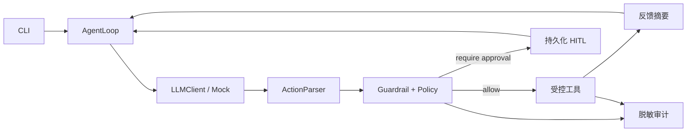

# Sentinel Coding Harness

Sentinel 是一个面向本地小型编码任务的 **CLI-only Coding Agent Harness**。它不把模型输出直接当作终端命令，而是把每一步限制为一个严格校验的 action，再经过路径围栏、策略判定、人工审批、受控工具和脱敏审计。项目的重点是“可验证的治理与 HITL（人机协作审批）”，不是追求模型自主改完大型仓库。

本仓库为 AI4SE 课程作业。核心 loop、Action 协议、工具层、策略、审批、审计、CLI 和测试均在本仓库自行实现；不依赖 LangChain、AutoGen、CrewAI、SWE-agent、OpenHands 等 agent runner。开源工程思想的参考边界见 [REFERENCES.md](REFERENCES.md)。

## 能力与架构

| Harness 维度 | Sentinel 中的实现 |
| --- | --- |
| 决策 | 自研 `AgentLoop`：构造上下文、请求模型、解析 action、执行并停机 |
| 工具 | 目录、文件、命令和测试的显式 dispatcher；命令采用 argv + `shell:false` |
| 记忆 | 本地 JSONL 笔记，按关键词和新近度检索，限制回灌条数与长度 |
| 治理 | 严格 Action parser、工作区真实路径围栏、策略引擎、HITL 审批与恢复 |
| 反馈 | 测试结果归类为短摘要，只把受控反馈提供给下一轮 |
| 配置 | 严格校验的 `harness.yaml`：模型、步数、预算、命令和风险策略 |



更细的协议、威胁模型和已知限制分别见 [SPEC.md](SPEC.md)、[THREAT_MODEL.md](THREAT_MODEL.md)。

## 环境与安装

- macOS 14+（凭据功能依赖登录用户的 Keychain）
- Node.js 20+
- npm 10+（建议与 Node 一起安装）

从源码安装：

```bash
git clone https://github.com/K11467/sentinel-coding-harness.git
cd sentinel-coding-harness
npm ci
npm run check
npm run build
```

`npm test` 与 `npm run check` 均使用脚本化 mock，不读取 API Key，也不请求 Provider，可作为离线检查。`npm run demo` 会离线运行三个确定性机制场景：危险动作在分发前被拦截、失败反馈导致下一步改选、审批只能消费一次。操作说明见 [DEMO_GUIDE.md](DEMO_GUIDE.md)。

发布版可从 [v0.1.0 GitHub Release](https://github.com/K11467/sentinel-coding-harness/releases/tag/v0.1.0) 下载 npm tarball；请同时下载并核对 `SHA256SUMS.txt`、Node/macOS 前提后再安装。

## CLI 概览

```text
sentinel config check [--config <path>]
sentinel credentials status|set|clear
sentinel run <task> [--config <path>]
sentinel resume <session> [--config <path>]
sentinel approve <session> <action-hash> [--config <path>]
sentinel reject|deny <session> <action-hash> [--config <path>]
sentinel inspect <session> [--config <path>]
sentinel audit <session> [--config <path>]
sentinel demo
```

CLI 明确拒绝 `--api-key`。`config check`、`credentials status` 和 `demo` 是最适合先验证安装的无真实 Provider 命令。`run` 会从 Keychain 仅内存读取凭据，将模型输出依次交给 parser、策略、审批、围栏工具和反馈层；它不是任意终端执行器。需要审批时先用 `inspect` 查看脱敏的动作摘要、风险和 action hash，再使用 `approve` 或 `deny`；`audit` 只展示脱敏、截断的策略/工具/状态摘要。

## 配置示例

将下列内容保存为工作区的 `harness.yaml`（完整示例在 [examples/harness.yaml](examples/harness.yaml)）：

```yaml
workspaceRoot: .
model: gpt-5.4-mini
maxSteps: 6
maxCostCny: 70
testCommand:
  command: npm
  args: [test]
allowedCommands:
  - command: npm
    argsPrefix: [test]
policyRules:
  - id: approval-network
    effect: require_approval
    risk: high
    match:
      types: [run_command]
      commands: [curl]
```

配置是严格的：未知字段、越界步数/预算或不安全的解释器命令都会报错。模型不能在 `run_tests` action 中自行替换 `testCommand`。

## 安全边界

- 所有模型 action 必须先通过严格 schema 和语义校验；内部 action id 只在本地验证后生成。
- 工作区操作拒绝绝对路径、`..` 穿越和符号链接逃逸；写入与读取有字节上限。
- 命令以参数数组启动，禁用 shell；解释器与 `-c` / `-e` 等高风险参数会被拒绝或转入策略审查。
- `git push`、提权、递归删除、发布和数据库破坏性动作属于直接拒绝或需审批范围；安全策略不能被 YAML 的 allow 规则降低。
- 审批绑定 session 和 action hash，采用持久化状态和原子更新；批准后仍会重新进行路径/策略检查。
- 审计记录与反馈只保留脱敏、截断后的摘要；写入内容记录字节数而不直接记录源码正文。

这些机制约束的是通过 Sentinel 发起的动作，不等价于隔离恶意本机进程。更准确的威胁边界见 [THREAT_MODEL.md](THREAT_MODEL.md)。

## Keychain 与真实 Provider

`credentials set` 设计为隐藏输入后写入当前 macOS 登录用户的 Keychain（service 为 `se-project`），而不是接收命令行参数、环境变量或明文配置文件。`credentials status` 只显示是否已配置，绝不输出 Key。本项目不会要求你把 Key 发到聊天、写入仓库或加入 CI。

真实 Provider 仅在使用者显式配置 Keychain、显式执行真实任务时才应被调用。适配器目标是智增增的 OpenAI 兼容 Responses endpoint，默认模型为 `gpt-5.4-mini`；实际费用以 Provider usage/账单为准，`maxCostCny` 是 Harness 的保守配置边界，不是对第三方计费的绝对保证。测试、CI 和离线演示不应配置真实 Key。

## 参考与许可证

本项目计划以 MIT 许可证发布。Aider、SWE-agent 与 OpenHands 的公开工程思想仅作设计参考，不是运行时依赖，也没有复制其核心实现或测试。链接、许可证和归因边界见 [REFERENCES.md](REFERENCES.md)。
