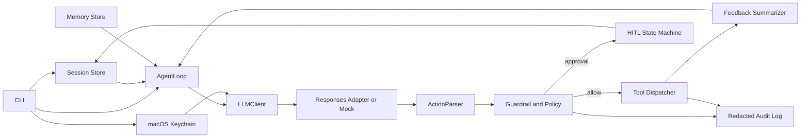

# Sentinel Coding Harness 规格说明

**版本：** 0.1.0（实现前确认版）
**项目类型：** Coding Agent Harness（纯 CLI）
**主要贡献：** 可验证的治理护栏与 HITL（Human-in-the-Loop）状态机

## 1. 问题陈述

面向个人开发者的 LLM 编码代理很容易把“提出下一步”直接变成“执行下一步”。当代理拥有读写文件、运行命令和调用测试的权限时，真正困难的不是让模型生成代码，而是让每次外部动作都可解析、可限制、可审计、可恢复。

Sentinel 是一个本地运行的命令行 Coding Agent Harness。它把单次 LLM 响应组织为严格的 agent 循环：构造上下文、请求一个结构化动作、验证并执行该动作、把确定性的工具/测试反馈回灌、满足停机条件后退出。它不建立在 LangChain、AutoGen、CrewAI、LlamaIndex Agent 或任何 Coding Agent SDK 的 runner 之上。

目标用户是希望在本地工作区试用低成本模型辅助完成小型编码任务、但不愿把所有 shell 与文件权限直接交给模型的学生和个人开发者。项目优先展示“怎样可靠地限制与验证 agent”，而不是追求自动改完大型代码库。

## 2. 范围与非目标

### 2.1 本版本范围

- 本地 CLI：配置凭据、运行任务、查看/批准暂停会话、运行机制演示。
- 单 agent 主循环，默认最多 6 步；每步只有一个结构化动作。
- 工作区内的读取、列目录、写入、受控命令和测试执行。
- 确定性策略引擎、审批状态机、审计记录、反馈回灌与轻量记忆。
- 可替换的 `LLMClient`：脚本化 mock 用于所有测试；智增增 Responses 适配器用于手工 smoke test。
- 发布 npm 包 tarball 到 GitHub Release；目标平台 macOS 14+、Node.js 20+。

### 2.2 非目标

- 不提供 WebUI、远程多用户服务或后台常驻服务。
- 不执行 `git push`、发布、数据库操作、Docker 控制或工作区外文件操作。
- 不做自动依赖安装、任意 shell、自治网络浏览或多 agent 编排。
- 不保证真实 LLM 每次均能完成编码任务；正确性以确定性验证器而非模型自评为准。

## 3. 用户故事

1. **作为本地开发者**，我希望通过隐藏输入将 API Key 保存到 macOS Keychain，以便运行 CLI 时不在命令、日志或仓库中暴露密钥。
2. **作为谨慎的开发者**，我希望 agent 只能在指定工作区读写，并且危险命令会暂停等待我的明确批准，以便模型无法越界执行高风险动作。
3. **作为使用者**，我希望 agent 运行测试后把失败摘要放入下一轮上下文，以便它可依据客观失败信号调整下一步动作。
4. **作为审批者**，我希望暂停会话可持久化、可查看风险原因、可一次性批准并恢复，以便人工控制不会丢失执行上下文。
5. **作为评审者**，我希望离线 mock 演示稳定复现“拦截危险动作—注入测试失败—下一步修正”的全过程，以便不依赖真实模型也能验证机制。
6. **作为维护者**，我希望看到动作、策略判定、工具结果和停止原因的脱敏审计记录，以便定位错误而不泄露密钥或完整源代码。

这些故事可独立交付、可测试、对目标用户有价值，并可随实现按优先级排序。

## 4. 领域与机制设计

### 4.1 六个 Harness 维度

| 维度 | 最低实现 | 主要验证方式 |
| --- | --- | --- |
| 决策 | 自研 `AgentLoop`，组织上下文、调用 LLM、解析动作、执行和停机 | mock LLM 给定动作序列，断言状态迁移 |
| 工具 | 文件、目录、命令、测试工具的显式 dispatcher | 传入构造的 action，断言工具路由与受控结果 |
| 记忆 | JSONL 决策/约定存储与关键词检索，最多回灌 5 条 | 写入、排序、去重、上限的确定性测试 |
| 治理 | 路径围栏、策略匹配、风险分类、审批/恢复状态机、审计 | 不注入真实 LLM 的单元/集成测试 |
| 反馈 | 测试结果压缩、失败分类、回灌下一轮上下文 | mock 测试失败后下一动作改变的测试 |
| 配置 | `harness.yaml` 的模型、预算、工作区、命令、风险和步数规则 | 配置校验与策略覆盖测试 |

### 4.2 重点维度：治理与 HITL

治理是本项目主要贡献，因为它可完全由确定性代码实现并独立验证。每个动作在执行前必须通过以下流水线：

1. **结构验证**：用 Zod 验证 JSON action 的字段、枚举和语义约束。
2. **工作区围栏**：将每个相对路径解析为真实路径；拒绝绝对路径、`..` 穿越、工作区外路径及符号链接逃逸。
3. **策略判定**：给出 `allow`、`require_approval` 或 `deny`，并附带规则 ID 和理由。
4. **审批状态机**：被要求审批的动作持久化为 `waiting_approval`；批准后只恢复同一 action，拒绝后结束/要求模型改选动作。
5. **审计与脱敏**：记录 action 摘要、策略判定、会话 ID、时间和结果；对 API Key、Authorization header 和长内容进行脱敏/截断。

默认策略如下：

- 自动允许：工作区内读取、列目录、普通源文件写入、`npm test`、`npm run lint`。
- 必须审批：删除文件、安装依赖、非白名单命令、修改 CI/发布配置、访问网络、提交 Git。
- 直接拒绝：工作区外路径、符号链接逃逸、递归删除、`git push`、提权命令、发布和数据库破坏性操作。

### 4.3 客观反馈闭环

`run_tests` 不相信模型的“我已修好”判断，而是启动受控测试命令、收集退出码和截断后的标准输出/错误，并把结果经 `FeedbackSummarizer` 归类为 `passed`、`assertion_failed`、`type_error`、`command_error` 或 `timeout`。失败摘要成为下一轮 `AgentContext.feedback`。循环检测到同一动作重复两次、达到 6 步、预算不足、不可恢复错误或任务完成动作后停止。

### 4.4 记忆与上下文

记忆不是把完整历史塞回 prompt，而是维护本地 JSONL `MemoryNote`：项目约定、经批准的决策、已知失败和用户显式保存的笔记。每轮按关键词重叠和新近度排序，取最多 5 条、每条最多 300 字符。会话动作历史最多保留最近 8 条。该检索算法可离线单测，不依赖向量服务。

## 5. 功能规约

### 5.1 Action 协议与 LLM 适配

**输入：** `AgentContext`（任务、工作区、可用工具、相关记忆、最近反馈）与预算。
**行为：** `LLMClient.decide()` 返回一个平坦、严格校验的 JSON envelope：`type`、`reason`、`path`、`content`、`command`、`args`、`note`、`summary`；不用字段填空字符串或空数组。`ActionParser` 先做 Zod 结构校验，再做按 action type 的语义校验。
**输出：** 判定为有效的 discriminated `Action`，或带可读错误的 `InvalidAction`。
**边界/错误：** provider 不能稳定支持 strict JSON Schema 时，适配器仅接受完整 JSON 文本并仍经同一 Zod/语义校验；无效 action 只能得到一次格式修复提示，第二次失败即安全停止。

生产适配器使用 `POST https://api.zhizengzeng.com/v1/responses`，默认模型 `gpt-5.4-mini`。它优先请求 Responses 的 strict JSON Schema 格式，并且即使 provider 已声明结构化输出，也一定在本地再次验证；该接口形态与 OpenAI 的 Responses 规范一致。[智增增 Responses 文档](https://doc.zhizengzeng.com/doc-7762827) [OpenAI Responses API 参考](https://platform.openai.com/docs/api-reference/responses)

### 5.2 Agent 主循环

**输入：** 已加载配置、任务文本、会话状态和 `LLMClient`。
**行为：** 依次构造上下文、请求 action、调用 `Guardrail`、执行/暂停、记录工具结果并追加反馈，直到终态。
**输出：** `completed`、`waiting_approval`、`blocked`、`failed` 或 `budget_exhausted` 会话。
**边界/错误：** 默认最多 6 步、单一网络超时 30 秒、最多一次网络重试、API 预算达到 70 元对应的应用内部上限前停止。真实费用以 provider usage 字段/手工账单为准，无法从客户端完全强制保证。

### 5.3 工具分发

**输入：** 有效 `Action` 和已验证工作区。
**行为：** 仅分派 `list_files`、`read_file`、`write_file`、`run_command`、`run_tests`、`remember` 和 `finish`。命令经 `spawn(command, args)` 执行，不使用 `shell: true` 或字符串拼接 shell。
**输出：** 统一 `ToolResult`（成功、退出码、截断输出、错误类别）。
**边界/错误：** 大文件、二进制文件、超时和非法参数均返回受控错误；所有路径首先经围栏检查。

### 5.4 治理与审批

**输入：** action、配置策略、会话 ID、审批状态。
**行为：** 生成确定性的 `PolicyDecision`；需要审批时保存一个不可变的 pending action；`approve` 只允许执行匹配会话及 action hash 的动作。
**输出：** `allow`、`require_approval` 或 `deny`，附带规则 ID、风险等级、理由。
**边界/错误：** 过期审批、篡改会话文件、无效 action hash、拒绝动作和审批后路径变化均不能执行目标动作。

### 5.5 反馈、记忆和配置

**输入：** 工具结果、测试输出、用户保存的 note 与 `harness.yaml`。
**行为：** 归类测试结果、截断/脱敏反馈、保存可检索记忆、解析配置并施加默认安全值。
**输出：** 下轮上下文和可审计状态。
**边界/错误：** 无效 YAML、未知策略、过长 note、无匹配记忆和测试命令缺失均返回显式错误；不得静默放宽策略。

### 5.6 凭据与 CLI

**输入：** 隐藏输入的 API Key，以及 `credentials set|status|clear`、`run`、`resume`、`demo` 命令。
**行为：** 通过 macOS `security` 保存 `se-project` 服务下的 `zhizengzeng-api-key`；`status` 只显示是否存在；`clear` 删除对应项。
**输出：** 无密钥内容的操作结果与退出码。
**边界/错误：** 非 macOS、Keychain 被锁定、Key 不存在或取消输入时不得回退为命令行参数、日志或明文文件。

## 6. 非功能性需求

- **安全：** 见 §9；默认拒绝高风险操作，所有测试使用 mock，不把真实 Key 写入任何文件或 Git 历史。
- **性能：** mock 演示和单测应在 10 秒内完成；单工具输出最多保留 4 KiB；文件读写上限 256 KiB。
- **可用性：** 每个 CLI 命令提供可操作的错误信息；暂停会话可列出、检查、批准或拒绝。
- **可观测性：** 每次状态迁移和策略决定写入脱敏 JSONL 审计；`--verbose` 不改变脱敏规则。
- **可复现性：** `npm test`、`npm run demo` 和 `npm run check` 在没有网络/Key 的环境可运行。

## 7. 系统架构与数据流

外部依赖仅为智增增 OpenAI 兼容 endpoint、macOS Keychain、Node.js 和 npm。Harness 自己不调用 OpenAI 内置工具、Agent SDK 或第三方 agent loop。

## 8. 数据模型

| 实体 | 关键字段与约束 |
| --- | --- |
| `HarnessConfig` | `workspaceRoot`、`model`、`maxSteps`、`maxCostCny`、白名单命令、策略规则；未知字段拒绝 |
| `Action` | `id`、`type`、`reason`、按类型所需参数；由 schema 和语义验证后构造 |
| `ToolResult` | `actionId`、`ok`、`kind`、`exitCode?`、截断内容、`errorCode?` |
| `PolicyDecision` | `effect`、`ruleId`、`risk`、`reason`、`actionHash` |
| `ApprovalRecord` | `sessionId`、`actionHash`、`status`、`createdAt`、`resolvedAt?`；只可单向转移 |
| `SessionState` | `id`、`status`、`step`、任务、最近 action/feedback、pending action、停止原因 |
| `MemoryNote` | `id`、`scope`、`text`、`keywords`、`createdAt`；最多 300 字符 |
| `AuditEvent` | 时间、会话、事件类型、脱敏 action 摘要、策略/工具结果；不含 Key |

## 9. 凭据威胁模型与对策

| 威胁 | 对策 |
| --- | --- |
| Key 被提交、粘贴到日志或 shell history | 不接受 `--api-key` 和环境变量输入；使用隐藏输入 + macOS Keychain；`.gitignore` 忽略 `.env`、密钥和运行数据；提交前执行 secret scan |
| 进程/终端回显 Key | `status` 仅显示存在性；日志层按正则脱敏 Authorization 与疑似 Key；异常对象不得 stringify request headers |
| LLM 诱导越界写入/命令执行 | 路径真实解析、符号链接检查、参数数组执行、白名单、deny 规则与审批状态机 |
| 批准被重放或会话被篡改 | action hash 绑定会话；审批只生效一次；会话更新原子写入；恢复前重新做路径/策略检查 |
| 第三方 provider 保存请求内容 | 默认只发送任务所需、截断后的上下文；适配器在兼容时显式请求不存储；README 明确第三方服务风险和用户责任 |
| CI/测试消耗 Key 或费用 | 默认 mock LLM；CI 不配置 provider Key；真实 smoke test 显式执行且有 70 元预算上限 |

## 10. 技术选型与分发

- **TypeScript / Node.js：** 当前环境可用，适合 CLI、文件系统、子进程和 JSON schema；便于用 Vitest 写快速确定性测试。
- **Zod：** 同时定义 action/config schema 和运行时验证，避免模型输出直接进入工具层。
- **Vitest：** 运行快速，适合 mock、状态机和参数化安全测试。
- **npm tarball + GitHub Release：** 不要求用户安装 Docker；Release 附带 `.tgz`、SHA-256 和 macOS/Node 前提。README 提供 `npm install -g <release-tarball>`。
- **CI：** GitHub Actions 运行 `npm ci && npm run check`；同时提供 `.gitlab-ci.yml` 的 `unit-test` job 以覆盖课程清单。
- **模型：** `gpt-5.4-mini`，通过智增增 `/v1/responses` 适配；模型名和 base URL 全部可配置。

不引入前端，因此不使用 Open Design。项目源码默认 MIT 许可；若后续引入第三方代码，必须先确认许可证、保留版权并在 README 列出。

## 11. 验收标准

1. `npm test` 在断网、没有 API Key 的机器上通过，覆盖主循环、工具分发、围栏、策略、审批、反馈、记忆、配置和停机。
2. mock demo 可重复展示危险 `rm`/越界 action 被拒绝或暂停、一次测试失败被回灌且 mock LLM 的下一动作不同、审批后状态正确恢复。
3. 任意构造的危险 action 不需真实 LLM 即可被 guardrail 确定性测试。
4. `credentials set/status/clear` 不显示明文 Key；secret scan 找不到疑似真实密钥。
5. `npm pack` 生成可安装 tarball，安装后 `sentinel --help`、`sentinel demo` 可运行。
6. GitHub Actions 和 GitLab 的 `unit-test` 定义存在；最终 Release 前最后一次 CI 为通过。
7. README 能让陌生 macOS 用户下载 Release、配置自己的 Key、运行 demo 和理解已知限制。

## 12. 风险与决策

- **异构冷启动 agent 不在本机：** 安装/配置 OpenCode 或其他不同类型 agent 后才执行冷启动验证；不满足该项不写实现代码。
- **第三方 Responses 兼容性差异：** 用一个隔离 adapter 和 capability/error test 限制影响面；不兼容 strict schema 时安全降级为本地严格验证，而非执行未验证文本。
- **十小时限制：** UI、多用户、向量数据库和任意 shell 均明确排除；优先保证 mock 机制与流程证据。
- **网络与费用：** CI 全离线；真实 smoke test 只在用户轮换 Key 已安全录入后进行，并在 70 元额度内。
- **过程真实性：** `AGENT_LOG.md`、`SPEC_PROCESS.md`、commit/PR 只记录真实事件，不补造历史；`REFLECTION.md` 由项目作者本人完成。
