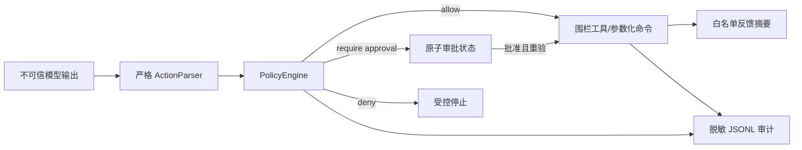

# 威胁模型与安全边界

Sentinel 把模型输出视为不可信输入。它的目标不是让模型拥有终端权限，而是在本地工作区内为每个动作建立可验证、可拒绝、可审计的执行链。

## 信任边界

## 主要风险与缓解

| 风险 | 主要缓解 | 证据位置 |
| --- | --- | --- |
| 模型输出未知字段、`null` 占位或伪造 action id | Zod strict envelope、语义校验，只有本地 parser 注入 id | `src/domain/actions.ts` |
| 路径穿越、绝对路径或符号链接逃逸 | canonical root、目录锚定 worker、final component `O_NOFOLLOW`、字节上限 | `src/tools/workspace.ts` |
| shell 注入和命令扩张 | argv 数组、`shell:false`、工具层二次参数过滤、保守白名单、超时杀进程组 | `src/tools/commands.ts` |
| 高风险写入、网络、安装、删除、Git 操作 | hard deny 优先，强制审批不能被 YAML allow 规则降低 | `src/security/policy.ts` |
| 审批重放、并发双执行、崩溃后半状态 | action hash、文件锁/CAS、同一聚合文件原子 rename、过期和时间因果检查 | `src/security/approval.ts` |
| Key、header、cookie、文件内容写入日志或反馈上下文 | Keychain 只读到内存；审计 redactor；反馈摘要白名单化；action content 仅记字节数 | `src/credentials/`, `src/observability/`, `src/feedback/` |
| Provider endpoint 劫持 | URL 严格固定为官方 HTTPS origin、端口和 `/v1/responses` 路径，`store:false` | `src/llm/zhizengzeng-responses.ts` |

## 明确的限制

- 目标平台是 macOS 14+、Node.js 20+。文件围栏针对通过 Harness 工具发出的动作；它不宣称能对抗同一 UID 的恶意本机进程在验证后主动重命名已锚定目录的强竞态。
- 原生命令进程组清理不能阻止恶意程序自行脱离进程组；因此命令仍受策略、白名单和审批约束，不能把 timeout 当作唯一防线。
- 费用上限是 Harness 内的保守步数/配置上限；真实 provider 费用须以 provider usage 与账单为准。
- Keychain 仅适用于用户自己的 macOS 登录环境。CI 与自动演示使用 mock，不设置或读取真实 API Key。
- 模型的建议不等于验证通过。任何 provider 返回文本仍必须经过本地 `ActionParser`、策略、审批与工具层检查。
